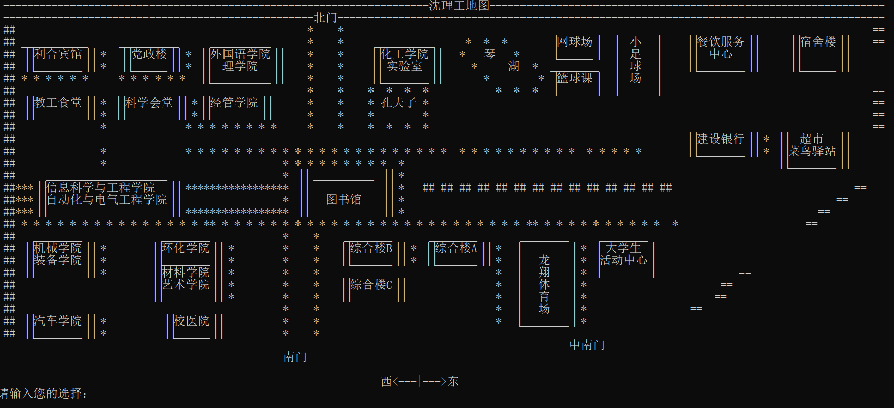
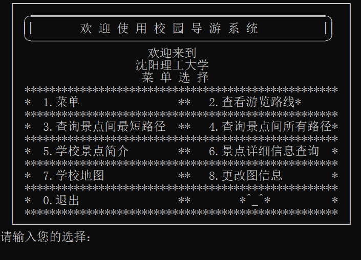

# 🧭 沈理工校园导航简易路线系统（本地版）



> 作者：Jia'nan Zhao  
> 开发时间：2020 年 12 月  
> 所属课程：项目实训C  
> 技术栈：C语言 + 邻接矩阵 + 图着色算法+经典最短路径算法（如 Dijkstra 和 Floyd 算法）


---

## 📌 项目简介



本项目旨在为来访沈阳理工大学的师生与游客提供一个**本地运行版校园导航系统**，通过简易的人机交互界面实现校园景点信息查询与最短路径推荐，提升校内参观与路径规划效率。

该系统基于图论和经典最短路径算法（如 Dijkstra 和 Floyd 算法），以“结构体 + 邻接矩阵”的方式构建校园景点网络。

---

## 🎯 核心功能

- ✅ 查询任意两个景点之间的最短路径（Dijkstra、Floyd 算法）
- ✅ 输出两景点间的所有可达路径
- ✅ 浏览所有校园景点信息（简介、详细介绍）
- ✅ 显示沈理工校园地图（字符图）
- ✅ 支持修改图结构：增删节点、修改边、重构图
- ✅ 可打印图的邻接矩阵
- ✅ 图形结构可持久化存储，便于修改与复用

---

## 🧱 技术架构

- 编程语言：**C语言**
- 存储结构：**邻接矩阵**
- 数据结构：无向图 + 权重边 + 景点信息结构体
- 算法实现：
  - `Dijkstra` 单源最短路径
  - `Floyd` 任意两点最短路径
  - 图的构建/重构/增删改查等基本操作

---

## 🗺️ 核心数据结构定义（节选）

```c
typedef struct arcell {
    int adj; // 边的权值
} arcell, adjmatrix[MaxVertexNum][MaxVertexNum];

typedef struct vexsinfo {
    int position;
    char name[32];
    char introduction[256];
    char super_introduction[512];
} vexsinfo;

typedef struct mgraph {
    vexsinfo vexs[MaxVertexNum];
    adjmatrix arcs;
    int vexnum, arcnum;
} mgraph;
```

---

## 💡 功能菜单界面

```text
(1) 重新建图
(2) 查询单源最短路径（Dijkstra）
(3) 查询任意两点最短路径（Floyd）
(4) 查询两景点间所有路径
(5) 浏览全部景点信息
(6) 查询指定景点介绍
(7) 显示校园地图（字符版）
(8) 用户登录（预留功能）
(0) 退出程序
```

---

## 🧪 测试结果展示

- 🌉 查询两点间所有路径
- 📍 查询景点最短路径
- 🏞️ 浏览景点详细介绍
- 🗺️ 打印字符版沈理工地图
- 🧰 修改图结构（添加/删除边与节点）
- 📑 邻接矩阵结构显示

---

## 📈 性能分析

- 使用邻接矩阵存储图结构，构图复杂度：`O(n^2 + e*n)`
- Dijkstra 算法时间复杂度：`O(n^2)`
- Floyd 算法时间复杂度：`O(n^3)`
- 实现交互式菜单界面，支持动态操作

---

## 🔧 存在问题与未来改进

### ✅ 已完成：
- 最短路径算法实现
- 图结构动态增删改查
- 景点信息完整存储和展示
- 简单人机交互界面

### ⚠️ 待改进：
- 无图形化界面，仅字符界面
- 增删节点等操作逻辑尚需优化
- 算法效率可通过邻接表等方式进一步提升

---

## 📝 参考资料

1. 《数据结构》 严蔚敏，吴伟民著，清华大学出版社
2. 《C语言程序设计》 马秀丽等编著，清华大学出版社

---


> © Jia'nan Zhao, School of Information Science and Engineering, Shenyang University of Technology
